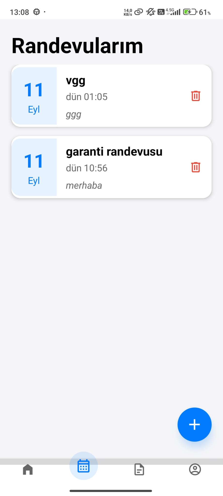

# 📱 Randevu ve Doküman Yönetim Sistemi Mobil Uygulaması

Bu proje, **React Native** ile geliştirilmiş, kullanıcıların kişisel randevularını ve önemli evraklarını yönetmelerine olanak tanıyan modern ve dinamik bir mobil uygulamadır.  
**Firebase** entegrasyonu sayesinde kimlik doğrulama, veritabanı işlemleri ve dosya depolama gibi ihtiyaçlar güvenli ve kolay bir şekilde karşılanmaktadır.

---

## 🎯 Projenin Amacı

Kullanıcıların günlük hayatlarını kolaylaştırmak, randevularını ve dijital evraklarını tek bir platform altında güvenli, düzenli ve erişilebilir bir şekilde saklamalarını sağlamak.  
Bu proje aynı zamanda bir **staj projesi** olup, modern mobil uygulama geliştirme pratiklerini uçtan uca uygulamayı hedeflemektedir.

---

## 🖼️ Uygulama Görselleri

  
  
  
  

---

## 🚀 Temel Özellikler

### 🔐 Kullanıcı Yönetimi

- **Kayıt Olma**: E-posta ve şifre ile hesap oluşturma
- **Giriş Yapma**: Güvenli kimlik doğrulama
- **Çıkış Yapma**: Oturum kapatma

### 📅 Randevu Yönetimi

- Randevuları **listeleme, ekleme, düzenleme, silme**
- Başlık, notlar ve tarih gibi detaylı bilgiler
- Firebase bildirim → Cloud Functions

### 📂 Evrak Yönetimi

- **PDF yükleme** (cihazdan seçim)
- **Firebase Storage** üzerinde güvenli saklama
- Evrak bilgileri: ad, boyut, indirme linki

### 👤 Kullanıcı Profili

- E-posta, ad-soyad görüntüleme
- Profil ekranından çıkış işlemi

### 🎨 Modern UI/UX

- **Animasyonlar** → `react-native-reanimated`
- **Dinamik Tema (Açık/Koyu)** → Redux
- **Modern Navigasyon** → React Navigation

---

## 🛠️ Kullanılan Teknolojiler

- **Çatı (Framework):** React Native
- **Backend Servisleri (BaaS):** Firebase
  - Authentication
  - Firestore
  - Storage
  - Cloud Functions
- **Navigasyon:** React Navigation (Stack & Bottom Tabs)
- **State Management:** Redux & Redux Toolkit
- **Animasyon:** React Native Reanimated
- **Tarih/Zaman:** Moment.js
- **Dosya Seçimi:** `@react-native-documents/picker`
- **Lokal Dosya Sistemi:** `react-native-fs`

---

## 📂 Proje Yapısı ve Mimarisi

- **Auth Akışı** → `LoginScreen`, `RegisterScreen`
- **Ana Navigasyon** → `AppTabs` (Anasayfa, Randevular, Evraklar, Profil)
- **Randevu Ekranları** → `AppointmentsScreen`, `AddAppointment`, `EditAppointment`
- **Profil Ekranı** → `ProfileScreen`
- **Evrak Yükleme** → `UploadDocument` (Modal)
- **Global State Yönetimi** → `store.js`, `themeSlice.js`
- **Service** → `appointmentService.js`, `documentService.js`

Bu yapı, **modüler**, **anlaşılır** ve **sürdürülebilir** bir kod mimarisi sunmaktadır.  
Firebase entegrasyonu sayesinde ayrıca sunucu tarafı kod yazmaya gerek kalmamış, hızlı geliştirme mümkün olmuştur.

---
